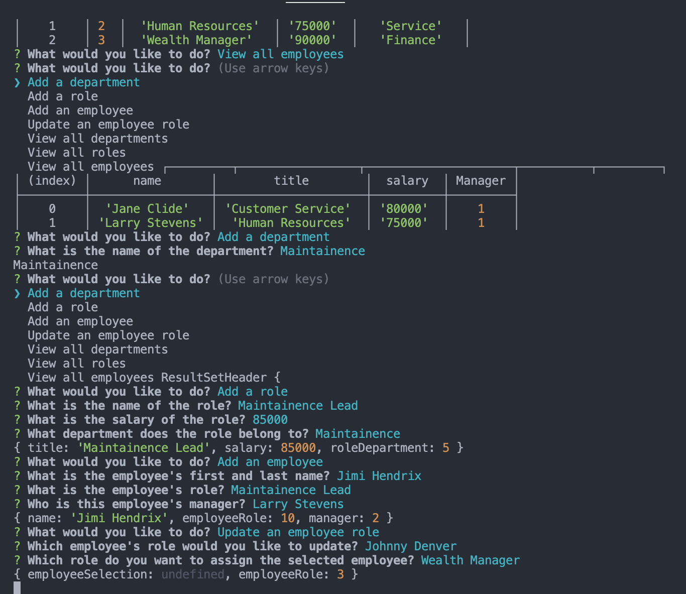

# Employee-Tracker

## Description
This is a command line SQL application that builds and maintains an employee database

## Usage

Use the following instructions to run the application:
1. Open up a terminal at the root of the application directory
2. Enter the command "node index"
3. Select one of the prompt questions according to your needs (Add a department, add a role, add an employee, update an employee, view all departments, view all roles, view all employees)
4. Answer the questions that follow

## Screenshot

URL to Walkthrough video:
https://www.awesomescreenshot.com/video/7956173?key=4b8496832a67601a55a76ae4e2765fe1
